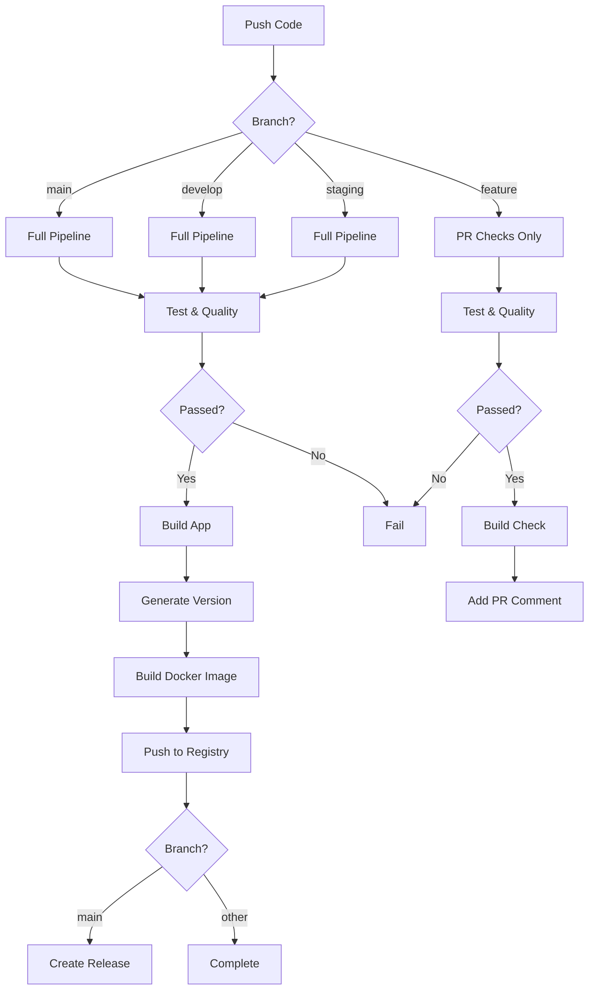

# Frontend GitHub Actions Workflows

## 📋 Overview

This directory contains GitHub Actions workflows for the TodoList Frontend application. The workflows automate testing, quality checks, building, and Docker image creation with automatic versioning.

## 🔄 Workflows

### 1. CI/CD Pipeline (`ci-cd.yml`)

**Purpose**: Main pipeline that runs tests, builds the app, and creates versioned Docker images.

**Triggers:**
- Push to `main`, `develop`, or `staging` branches
- Pull requests to these branches

**Stages:**

#### Stage 1: Test & Quality Checks ✅
- Code formatting (Prettier)
- Linting (ESLint)
- TypeScript type checking
- Unit tests with coverage
- Accessibility tests
- Security audit

#### Stage 2: Build Application 🏗️
- Build production bundle
- Check bundle size (max 5MB)
- Generate version number
- Upload build artifacts

#### Stage 3: Docker Build & Push 🐳
- Build multi-architecture Docker image (amd64, arm64)
- Push to GitHub Container Registry
- Tag with multiple versions
- Security scan with Trivy

#### Stage 4: Create Release 🎉
- Create GitHub release (main branch only)
- Attach build artifacts
- Document Docker pull commands

### 2. PR Quality Checks (`pr-checks.yml`)

**Purpose**: Comprehensive quality checks for pull requests with automated comments.

**Features:**
- All quality checks from main pipeline
- Coverage report in PR comments
- Console.log detection
- Bundle size warnings
- Automated PR summary comment

## 🏷️ Version Strategy

Versions are automatically generated based on the branch:

| Branch | Version Format | Example | Docker Tags |
|--------|---------------|---------|-------------|
| `main` | `v1.0.{BUILD_NUMBER}` | `v1.0.42` | `latest`, `stable`, `v1.0.42`, `{sha}` |
| `staging` | `v1.0.{BUILD_NUMBER}-rc` | `v1.0.42-rc` | `staging`, `v1.0.42-rc`, `{sha}` |
| `develop` | `dev-{TIMESTAMP}` | `dev-20250106.143022` | `develop`, `dev-20250106.143022`, `{sha}` |
| Feature branches | `feature-{BRANCH}-{SHA}` | `feature-new-ui-abc1234` | `feature-new-ui-abc1234`, `{sha}` |

## 🔐 Required Secrets

Configure these in GitHub repository settings: `Settings → Secrets and variables → Actions`

### Essential Secrets

| Secret | Description | Required |
|--------|-------------|----------|
| `REACT_APP_API_URL` | Backend API URL | ✅ Yes |
| `REACT_APP_CLERK_PUBLISHABLE_KEY` | Clerk authentication key | ✅ Yes |
| `CODECOV_TOKEN` | Codecov.io integration token | ⚠️ Optional |

### Auto-Provided by GitHub

| Secret | Description |
|--------|-------------|
| `GITHUB_TOKEN` | Automatically provided for GitHub Container Registry |

## 🚀 Quick Start

### 1. Setup Secrets

```bash
# Using GitHub CLI
gh secret set REACT_APP_API_URL --body "https://api.yourdomain.com"
gh secret set REACT_APP_CLERK_PUBLISHABLE_KEY --body "pk_live_..."
gh secret set CODECOV_TOKEN --body "your-codecov-token"
```

### 2. Enable GitHub Container Registry

1. Go to repository `Settings`
2. Navigate to `Actions → General`
3. Under "Workflow permissions", select **"Read and write permissions"**
4. Check **"Allow GitHub Actions to create and approve pull requests"**

### 3. First Push

```bash
git add .
git commit -m "feat: initial setup"
git push origin main
```

The workflow will automatically:
1. ✅ Run all tests and quality checks
2. 🏗️ Build the application
3. 🐳 Create and push Docker image
4. 🎉 Create a GitHub release

## 📦 Using Docker Images

### Pull Latest Image

```bash
# Latest stable (from main branch)
docker pull ghcr.io/YOUR_USERNAME/REPO:latest

# Specific version
docker pull ghcr.io/YOUR_USERNAME/REPO:v1.0.42

# Development version
docker pull ghcr.io/YOUR_USERNAME/REPO:develop
```

### Run Container

```bash
docker run -d -p 80:80 \
  -e REACT_APP_API_URL=https://api.yourdomain.com \
  -e REACT_APP_CLERK_PUBLISHABLE_KEY=pk_live_... \
  ghcr.io/YOUR_USERNAME/REPO:latest
```

### docker-compose.yml Example

```yaml
version: '3.8'
services:
  frontend:
    image: ghcr.io/YOUR_USERNAME/REPO:latest
    ports:
      - "80:80"
    environment:
      - REACT_APP_API_URL=https://api.yourdomain.com
      - REACT_APP_CLERK_PUBLISHABLE_KEY=pk_live_...
```

## 📊 Monitoring Workflows

### View Workflow Status

```bash
# List all workflows
gh workflow list

# View recent runs
gh run list --workflow=ci-cd.yml

# Watch current run
gh run watch
```

### View Workflow Details

```bash
# View specific run
gh run view <run-id>

# View logs
gh run view <run-id> --log

# Download artifacts
gh run download <run-id>
```

## 🐛 Troubleshooting

### Build Fails on Bundle Size

**Error:** Bundle size exceeds threshold

**Solution:**
```bash
# Analyze bundle size locally
npm run build:analyze

# Reduce bundle size:
# - Enable code splitting
# - Use dynamic imports
# - Remove unused dependencies
```

### Docker Push Permission Denied

**Error:** Permission denied when pushing to registry

**Solution:**
1. Go to `Settings → Actions → General`
2. Set workflow permissions to "Read and write"
3. Re-run the workflow

### Tests Fail in CI but Pass Locally

**Common causes:**
- Missing environment variables
- Timezone differences
- Async timing issues

**Solution:**
```yaml
# Add to test step
env:
  TZ: UTC
  CI: true
  NODE_ENV: test
```

### Image Not Found

**Error:** Cannot pull Docker image

**Solution:**
1. Check if workflow completed successfully
2. Verify image name: `ghcr.io/USERNAME/REPO:TAG`
3. Ensure you're authenticated: `echo $GITHUB_TOKEN | docker login ghcr.io -u USERNAME --password-stdin`

## 🎯 Best Practices

### 1. Branch Strategy

```bash
# Feature development
git checkout -b feature/new-feature
git push origin feature/new-feature
# Creates: feature-new-feature-{sha}

# Development testing
git checkout develop
git merge feature/new-feature
git push origin develop
# Creates: dev-{timestamp}

# Staging release
git checkout staging
git merge develop
git push origin staging
# Creates: v1.0.{build}-rc

# Production release
git checkout main
git merge staging
git push origin main
# Creates: v1.0.{build} + GitHub release
```

### 2. Semantic Commit Messages

```bash
feat: add user authentication
fix: resolve login redirect issue
docs: update API documentation
style: format code with prettier
refactor: restructure component hierarchy
test: add unit tests for auth flow
chore: update dependencies
```

### 3. PR Workflow

1. Create feature branch from `develop`
2. Make changes and commit
3. Push and create PR
4. Wait for PR checks to pass
5. Address any issues flagged by automated checks
6. Request review
7. Merge after approval

## 📈 Status Badges

Add to your README.md:

```markdown
[](https://github.com/USERNAME/REPO/actions/workflows/ci-cd.yml)
[](https://codecov.io/gh/USERNAME/REPO)
```

## 🔄 Workflow Lifecycle



## 📚 Additional Resources

- [GitHub Actions Documentation](https://docs.github.com/en/actions)
- [Docker Build Push Action](https://github.com/docker/build-push-action)
- [GitHub Container Registry](https://docs.github.com/en/packages/working-with-a-github-packages-registry/working-with-the-container-registry)
- [Semantic Versioning](https://semver.org/)

## 🆘 Support

For issues or questions:
- Check workflow logs: `gh run view --log`
- Review this documentation
- Open an issue on GitHub
- Contact the DevOps team

---

**Last Updated:** 2025-01-06
