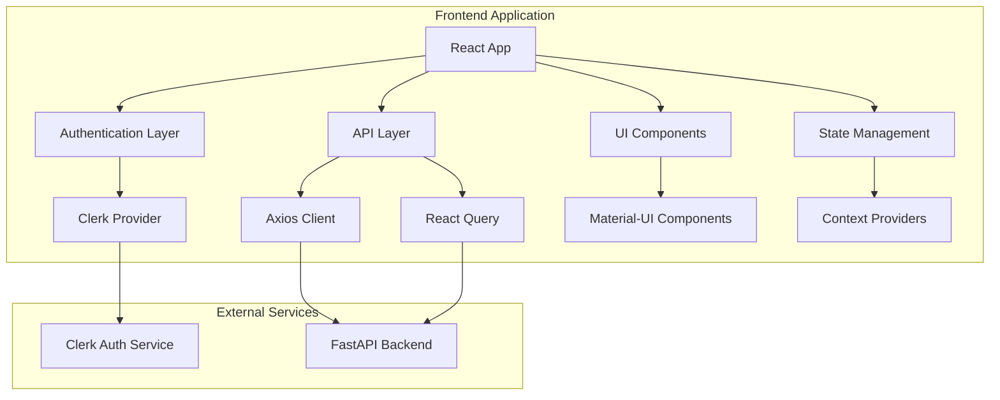

# Design Document

## Overview

The todolist frontend is a modern, responsive React application that provides an intuitive interface for managing todos, projects, and AI-powered features. The application follows Material Design principles and integrates seamlessly with the existing FastAPI backend and Clerk authentication system.

### Key Technologies
- **React 18** with TypeScript for type safety and modern development
- **Material-UI (MUI) v5** for consistent Material Design components
- **Clerk** for authentication and user management
- **React Query (TanStack Query)** for efficient API state management
- **React Router v6** for client-side routing
- **Axios** for HTTP requests
- **React Hook Form** with Zod validation for form handling
- **Framer Motion** for smooth animations and transitions

## Architecture

### High-Level Architecture



### Folder Structure

```
src/
├── components/           # Reusable UI components
│   ├── common/          # Generic components (Button, Modal, etc.)
│   ├── forms/           # Form components
│   ├── layout/          # Layout components (Header, Sidebar, etc.)
│   └── ui/              # Specific UI components
├── pages/               # Page components
│   ├── auth/            # Authentication pages
│   ├── dashboard/       # Dashboard page
│   ├── todos/           # Todo-related pages
│   ├── projects/        # Project-related pages
│   └── ai/              # AI features pages
├── hooks/               # Custom React hooks
├── services/            # API service functions
├── types/               # TypeScript type definitions
├── utils/               # Utility functions
├── contexts/            # React context providers
├── constants/           # Application constants
└── styles/              # Global styles and theme
```

## Components and Interfaces

### Core Components

#### 1. Authentication Components
- **LoginPage**: Clerk-powered login interface
- **SignupPage**: User registration with Clerk
- **ProtectedRoute**: Route wrapper for authenticated access
- **UserProfile**: User profile management

#### 2. Layout Components
- **AppLayout**: Main application layout with navigation
- **Header**: Top navigation bar with user menu
- **Sidebar**: Collapsible navigation sidebar
- **MobileNavigation**: Bottom navigation for mobile devices

#### 3. Todo Components
- **TodoList**: Displays paginated list of todos
- **TodoCard**: Individual todo item with actions
- **TodoForm**: Create/edit todo form
- **TodoFilters**: Filter and search interface
- **TodoStats**: Statistics dashboard for todos

#### 4. Project Components
- **ProjectList**: Grid/list view of projects
- **ProjectCard**: Individual project with todo counts
- **ProjectForm**: Create/edit project form
- **ProjectDetail**: Detailed project view with todos

#### 5. AI Components
- **AISubtaskGenerator**: Interface for generating AI subtasks
- **AIFileAnalyzer**: File analysis interface
- **AIStatusIndicator**: Shows AI service availability
- **AIErrorHandler**: Handles and displays AI-related errors

### API Integration Layer

#### API Client Configuration
```typescript
// Base API client with Clerk authentication
const apiClient = axios.create({
  baseURL: process.env.REACT_APP_API_URL,
  timeout: 10000,
});

// Request interceptor for authentication
apiClient.interceptors.request.use(async (config) => {
  const token = await getToken();
  if (token) {
    config.headers.Authorization = `Bearer ${token}`;
  }
  return config;
});
```

#### Service Functions
- **todoService**: CRUD operations for todos
- **projectService**: CRUD operations for projects
- **aiService**: AI-powered features
- **userService**: User management operations

### State Management Strategy

#### React Query for Server State
- Automatic caching and synchronization
- Background refetching
- Optimistic updates
- Error handling and retry logic

#### Context for Client State
- Theme preferences
- UI state (sidebar collapsed, etc.)
- User preferences
- Notification system

## Data Models

### Frontend Type Definitions

```typescript
// Todo Types
interface Todo {
  id: string;
  user_id: string;
  project_id?: string;
  parent_todo_id?: string;
  title: string;
  description?: string;
  status: 'todo' | 'in_progress' | 'done';
  priority: 1 | 2 | 3 | 4 | 5;
  due_date?: string;
  completed_at?: string;
  ai_generated: boolean;
  created_at: string;
  updated_at: string;
}

// Project Types
interface Project {
  id: string;
  user_id: string;
  name: string;
  description?: string;
  todo_count?: number;
  completed_todo_count?: number;
  created_at: string;
  updated_at: string;
}

// AI Types
interface AISubtaskRequest {
  todo_id: string;
  max_subtasks: number;
}

interface GeneratedSubtask {
  title: string;
  description?: string;
  priority: number;
  estimated_time?: string;
  order: number;
}
```

### Form Validation Schemas

```typescript
// Using Zod for runtime validation
const todoSchema = z.object({
  title: z.string().min(1).max(500),
  description: z.string().optional(),
  status: z.enum(['todo', 'in_progress', 'done']),
  priority: z.number().min(1).max(5),
  due_date: z.string().datetime().optional(),
  project_id: z.string().uuid().optional(),
});
```

## Error Handling

### Error Boundary Strategy
- Global error boundary for unhandled errors
- Component-specific error boundaries for isolated failures
- Graceful degradation for non-critical features

### API Error Handling
- Standardized error response format
- User-friendly error messages
- Retry mechanisms for transient failures
- Offline state handling

### AI Service Error Handling
- Specific error types (quota exceeded, rate limited, etc.)
- Fallback options when AI services are unavailable
- Clear user guidance for error resolution

## Testing Strategy

### Unit Testing
- **Jest** and **React Testing Library** for component testing
- **MSW (Mock Service Worker)** for API mocking
- Custom hooks testing with **@testing-library/react-hooks**

### Integration Testing
- End-to-end user workflows
- API integration testing
- Authentication flow testing

### Test Coverage Goals
- 80%+ code coverage for critical components
- 100% coverage for utility functions
- Integration tests for all major user flows

## Performance Optimization

### Code Splitting
- Route-based code splitting with React.lazy()
- Component-level splitting for heavy components
- Dynamic imports for non-critical features

### Caching Strategy
- React Query for API response caching
- Service worker for static asset caching
- Local storage for user preferences

### Bundle Optimization
- Tree shaking for unused code elimination
- Webpack bundle analysis and optimization
- Lazy loading for images and heavy components

## Responsive Design

### Breakpoint Strategy
```typescript
const breakpoints = {
  xs: '0px',
  sm: '600px',
  md: '900px',
  lg: '1200px',
  xl: '1536px',
};
```

### Mobile-First Approach
- Progressive enhancement from mobile to desktop
- Touch-friendly interactions
- Optimized navigation for small screens

### Adaptive Layouts
- Grid system using MUI's responsive grid
- Flexible component layouts
- Context-aware UI elements

## Security Considerations

### Authentication Security
- Clerk JWT token validation
- Automatic token refresh
- Secure token storage

### Data Protection
- Input sanitization and validation
- XSS prevention measures
- CSRF protection through proper headers

### API Security
- Request/response validation
- Rate limiting awareness
- Secure error handling (no sensitive data exposure)

## Accessibility

### WCAG 2.1 Compliance
- AA level compliance target
- Semantic HTML structure
- Proper ARIA labels and roles

### Keyboard Navigation
- Full keyboard accessibility
- Focus management
- Skip links for navigation

### Screen Reader Support
- Descriptive alt text for images
- Proper heading hierarchy
- Live regions for dynamic content

## Internationalization (Future Enhancement)

### i18n Preparation
- React-i18next integration ready
- Externalized text strings
- RTL language support consideration

## Material Design Implementation

### Theme Configuration
```typescript
const theme = createTheme({
  palette: {
    mode: 'light', // Support for dark mode
    primary: {
      main: '#1976d2',
    },
    secondary: {
      main: '#dc004e',
    },
  },
  typography: {
    fontFamily: 'Roboto, Arial, sans-serif',
  },
  components: {
    // Custom component overrides
  },
});
```

### Animation Guidelines
- Material Design motion principles
- Consistent timing functions
- Meaningful transitions
- Performance-optimized animations

## Development Workflow

### Development Environment
- Create React App with TypeScript template
- ESLint and Prettier for code quality
- Husky for pre-commit hooks
- Conventional commits for changelog generation

### Build and Deployment
- Production build optimization
- Environment-specific configurations
- CI/CD pipeline integration
- Static hosting deployment (Vercel/Netlify)